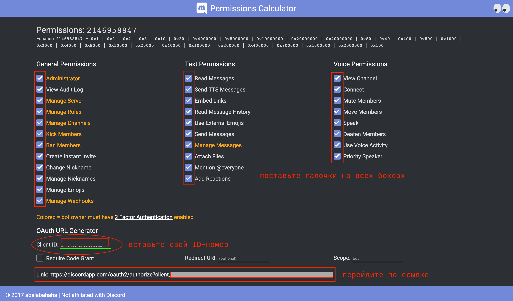

# Tutorial-Bot
a simple bot for tutorial purposes (простой бот для учебных целей)

[](https://opensource.org/licenses/MIT)

[](https://GitHub.com/Naereen/StrapDown.js/graphs/contributors/)

[](https://github.com/ellerbrock/open-source-badges/)

[](https://saythanks.io/to/kennethreitz)

[](https://GitHub.com/Naereen/)


### Создаем бота в Discord для сервера.

**Вам понадобятся**:
- Редактор кода > [Visual Studio Code](https://code.visualstudio.com/)
- [Node JS](https://nodejs.org/en/)
- [Библиотека Discord.js](https://discord.js.org/#/)

1. Открываем редактор кода (VSCode) и через **"Add workspace folder"** создаем папку для проекта.


2. Открываем терминал в редакторе через **> Terminal > New Terminal и вводим команду >**

			`npm init` (нажимаем Enter)


в конце на вопрос **Is this OK? (yes) >** набираем команду yes и нажимаем Enter

Теперь в рабочей папке появился файл **> package.json**

Открываем его в редакторе и в **"description"** прописываем описание вашего бота и по желанию в графе **"author"** (автор) свои инициалы. Сохраняем через команду **CMD + S** для **Mac OS** или **CTRL + S** для **Windows**.


3. Возвращаемся в терминал и подключаем модуль Дискорда через **команду >**
                     
 		`npm install discord.js --save` и нажимаем Enter


4. Переходи в файл **index.js** и прописываем две строки кода: 

		`const Discord = require("discord.js");`
		`const client = new Discord.Client();`

**NB:** Вместо **"Discord"** и **"client"** можно вставить свои названия.

5. Переходим на сайт [Discord Developer Portal](https://discordapp.com/developers/applications/) для регистрации бота в своем Дискорде через функцию **"New Application"**


6. Далее копируем токен бота (предварительно создав его через функцию **"Add bot"**) и переходим в редактор, дописываем следующую строку кода:

		`client.login("ВАШ_ТОКЕН");`


7. Для добавления бота на сервер, переходим в раздел **"General Information"** и копируем **Client ID**.


8. Далее переходим на страницу **Discord > Permissions Calculator**, тикаем все боксы и в нижней графе **Client ID** вставляем скопированный **ID-номер**. Далее переходим по ссылке для авторизации и добавления бота на сервер. 




9. Прописываем простую команду для бота в файле **index.js**:

```javascript

client.on('message', (message) => {
    if(message.content == "hello bot") // если содержимое сообщения "hello bot" (можете подставить свой текст)
    {
        message.channel.send("hi there!"); // бот отправит сообщение "hi there!" (можете подставить свой текст)
    }
});
```


10. Запускаем бота через терминал командой:
		`node .`


